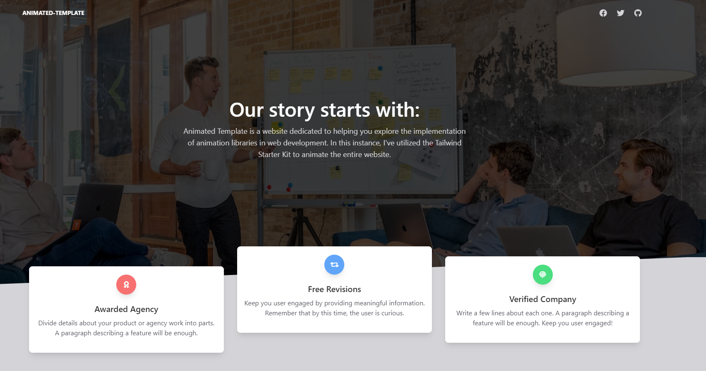
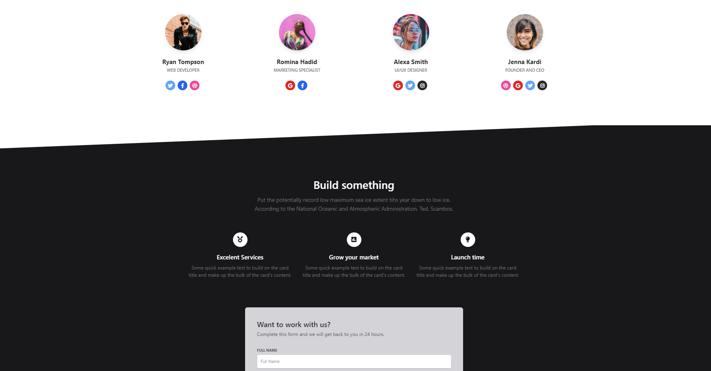

<!-- TABLE OF CONTENTS -->

# 📗 Table of Contents

- [📖 About the Project](#about-project)
  - [📖 Sample Of Website](#Sample-Of-Website)
    - [🛠 Built With](#built-with)
    - [Tech Stack](#tech-stack)
    - [Key Features](#key-features)
  - [🚀 Live Demo](#live-demo)
- [👥 Authors](#authors)
- [🤝 Contributing](#contributing)
- [⭐️ Show your support](#support)
- [🙏 Acknowledgements](#acknowledgements)
- [📩 Support & Feedback](#support)
- [📝 License](#license)

<!-- PROJECT DESCRIPTION -->

# 📖 My Portafolio 

> Animated Template is a website dedicated to helping you explore the implementation of animation libraries in web development. In this instance, I've utilized the Tailwind Starter Kit to animate the entire website. Feel free to experience the live demo for yourself.

# Sample Of Website 

## 🛠 Built With 

### Tech Stack 

  
Client

  <ul>
        <li><a href="https://en.wikipedia.org/wiki/HTML">Html</a></li>
        <li><a href="https://en.wikipedia.org/wiki/CSS">Css</a></li>
        <li><a href="https://nl.wikipedia.org/wikiJavaScript">Javascript</a></li>
              <li><a href="https://www.creative-tim.com/learning-lab/tailwind-starter-kit/presentation?utm_source=tailkits&utm_medium=referral&utm_campaign=components">Tailwind Starter Kit</a></li>
  </ul>

<!-- Features -->

### Key Features 

- **[multi-page responsive website]**
- **[flex & grid]**
- **[LightMode & DarkMode]**
- **[Advanced CSS]**

(<a href="#readme-top">back to top</a>)

<!-- LIVE DEMO -->

## 🚀 Live Demo 

> Add a link to your deployed project.

- [Live Demo Link](https://ameer2000mzori.github.io/Animated-Template/landing)

(<a href="#readme-top">back to top</a>)

<!-- AUTHORS -->

## 👥 Authors 

👤 **Author1**

- GitHub: [@Ameer2000Mzori](https://github.com/Ameer2000Mzori)
- LinkedIn: [Ameer Ameen](https://www.linkedin.com/in/ameer-ameen-82314425b/)

(<a href="#readme-top">back to top</a>)

<!-- CONTRIBUTING -->

## 🤝 Contributing 

Contributions, issues, and feature requests are welcome! please dont forget to contact ameerapex496@gmail.com

Feel free to check the [issues page](../../issues/).

(<a href="#readme-top">back to top</a>)

<!-- SUPPORT -->

## ⭐️ Show your support 

If you like this project, don't hesitate to give it a star 😊.

(<a href="#readme-top">back to top</a>)

<!-- ACKNOWLEDGEMENTS -->

## 🙏 Acknowledgments 

(<a href="#readme-top">back to top</a>)

<!-- Support and feedback -->

## 📩 Support & Feedback 

If you have any feedback, please reach out to me at ameerapex496@gmail.com 📨

(<a href="#readme-top">back to top</a>)

<!-- LICENSE -->

## 📝 License 

This project is [MIT](./LICENSE) licensed.

_NOTE: we recommend using the [MIT license](https://choosealicense.com/licenses/mit/) - you can set it up quickly by [using templates available on GitHub](https://docs.github.com/en/communities/setting-up-your-project-for-healthy-contributions/adding-a-license-to-a-repository). You can also use [any other license](https://choosealicense.com/licenses/) if you wish._

(<a href="#readme-top">back to top</a>)

